  

   

### 👋 About

I build machine-learning systems that survive contact with production — and the pipelines that keep them fed.

Right now that means **physics-informed neural networks (PINNs / PINO)** for PDE-constrained materials research at **Helmholtz-Zentrum Hereon**, and **Python ETL + AWS automation** at **t2consult**, where log data from Linux and Windows fleets lands in Redshift, Grafana and CloudWatch without anyone touching it.

Six years across BI, NLP and full-stack before that — which mostly taught me that the model is the easy part.

<table>
<tr>
<td width="50%" valign="top">

**🔬 Currently building**

- PINNs/PINO for corrosion-kinetics inversion, with uncertainty quantification — M.Sc. thesis @ **Hereon** *(→ Jul 2026)*
- Python ETL → **Redshift / Grafana / CloudWatch** observability stack @ **t2consult**
- Hybrid automation with **n8n + AWS Lambda** — cut manual Jira reporting ~30%

</td>
<td width="50%" valign="top">

**🌱 Currently learning**

- **Kubernetes** & **Terraform** for reproducible ML infrastructure
- Uncertainty quantification + experiment versioning in training pipelines
- **German B2 → C1** 🇩🇪

</td>
</tr>
</table>

> **Open to:** production ML / MLOps roles, scientific-ML collaborations, and open source around data pipelines or NLP.
> Happy to talk PINNs, Redshift cost tuning, or why your Airflow DAG is lying to you.

### 🧭 Career Path

### 🚀 Featured Work

<table>
<tr>
<td width="50%"></td>
<td width="50%"></td>
</tr>
<tr>
<td width="50%"></td>
<td width="50%"></td>
</tr>
</table>

### 🛠️ Tech Stack

|  |  |
| :--- | :--- |
| **Languages** |         |
| **ML & Deep Learning** |         |
| **Cloud & MLOps** |          |
| **Data & Observability** |         |
| **Web** |      |

### 🎓 Education & Credentials

**M.Sc. Data Science** — Kiel University of Applied Sciences *(2022 – 2026)*
**B.Sc. Information Technologies** — Eastern Mediterranean University *(2018 – 2021)*

    

**Languages** —    

### 💬 Let's build something

Open to collaboration, contract work, and full-time roles across Germany & remote EU.

  

📍 Kiel, Germany · 🇩🇪 🇬🇧 🇹🇷 🇮🇷

